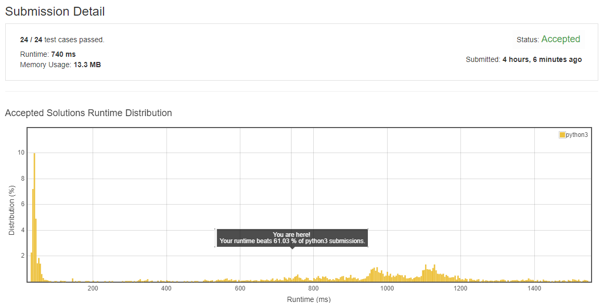
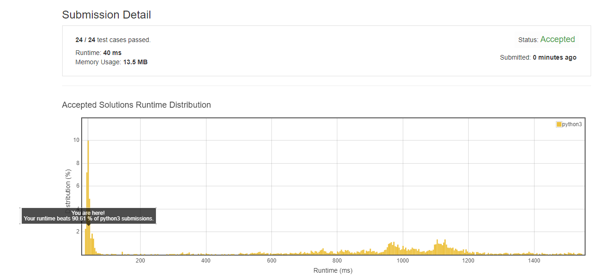

# 实验报告
设计一个$O(n\lg n)$的算法，求一个n个数的序列的最长单调递增子序列(LIS).

## 实验环境
CPU：Intel Core i5-7200U

内存：8GB

操作系统：Windows 10 64位教育版

编程语言：Python 3.6

运行方式：直接运行LIS.py文件即可

## 算法分析
### $O(n^2)$时间的算法
记nums为一个长度为n的序列，c[i]为nums的前n个数组成的子序列的最长单增子序列长度，则可证明该问题具有最优子结构，递推公式为：
$$
c[i]=
\begin{cases}
    0, &i=0\\
    \max(c[k]+1),\text{ k<i and x[k]<x[i]}, &i>0 
\end{cases}
$$

利用动态规划可得时间复杂度为$O(n^2)$的算法：

```python
def LIS(nums):
        n=len(nums)
        c=[1 for i in range(n)]
        for i in range(1,n):
            for k in range(i-1,-1,-1):
                if nums[k]<nums[i]:
                    if c[k]+1>c[i]:
                        c[i]=c[k]+1
        max=0
        max_index=0
        for i in range(n):
            if c[i] > max:
                max=c[i]
                max_index=i
        ret=[]
        ret.append(nums[max_index])
        max=max-1
        for i in range(max_index-1,-1,-1):
            if c[i]==max:
                ret.append(nums[i])
                max=max-1
        ret.reverse()
        return ret
```

### $O(n\lg n)$时间的算法
在$O(n^2)$算法的基础上，我们可以进一步优化.记tails[i]为nums的长度为(i+1)的单增子序列的最小尾数，由题目中的提示可知，tails是一个（非严格）单增数组.遍历nums中的元素nums[i]，若nums[i]大于tails中的最大值tails[j-1]（对应长度为(j)的单增子序列），则nums[i]就是长度为(j+1)的单增子序列的尾数，即tails[j]=nums[i]；若nums[i]在tails[j-1]和tails[j]之间，那么说明tails[j]不是最小的尾数，即tails[j]=nums[i].同时在这个过程中，c[i]就是nums[i]在tails中所处的位置.因为tails是单增数组，所以可以使用二分查找来压缩时间复杂度，可以达到$O(n\lg n)$.

算法实现如下：

```python
def LIS(nums):
    def bSearch(tails, target, l, h):
        while l <= h:
            m = (h + l) // 2
            if tails[m] < target:
                l = m + 1
            elif tails[m] > target:
                h = m - 1
            else:
                return m
        return l

    n=len(nums)
    tails = [nums[0]]
    c=[0 for i in range(n)]
    for i in range(len(nums)):
        j = bSearch(tails, nums[i], 0, len(tails)-1)
        c[i] = j;
        if j >= len(tails):
            tails.append(nums[i])
        else:
            tails[j] = nums[i]
    
    max=0
    max_index=0
    for i in range(n):
        if c[i] > max:
            max=c[i]
            max_index=i
    ret=[]
    ret.append(nums[max_index])
    max=max-1
    for i in range(max_index-1,-1,-1):
        if c[i]==max:
            ret.append(nums[i])
            max=max-1
    ret.reverse()
    return ret
```

## 结果分析
为了证明$O(n^2)$和$O(n\lg n)$两种算法的正确性和时间差异，采用[LeetCode平台](https://leetcode.com/problems/longest-increasing-subsequence/)对两种算法分别进行了评测.

$O(n^2)$算法的结果：



$O(n\lg n)$算法的结果：



两种算法都通过了所有case，$O(n\lg n)$算法在运行时间上表现出巨大的优势，两种算法占用内存空间大致相同.